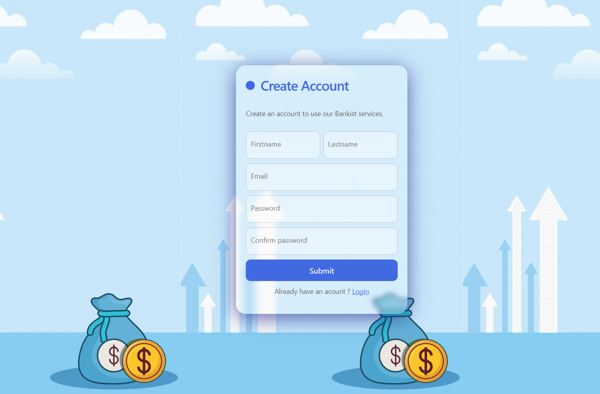

### README for Banking Application

# Banking Application

This is a comprehensive banking application developed using HTML, CSS, and JavaScript for the frontend, and Express.js for the backend. The application allows users to register, login, transfer money, request loans, and view their transaction history. The backend is connected to a MongoDB database for data storage.

## Features

- **User Registration:** Allows new users to create an account.
- **User Login:** Existing users can log in to their account.
- **Balance Overview:** Users can view their current balance.
- **Transaction History:** Users can see a history of their deposits and withdrawals.
- **Money Transfer:** Users can transfer money to other accounts.
- **Loan Request:** Users can request a loan.
- **Account Management:** Users can close their account.

## Project Structure

```bash
Banking/
├── backend/
│   ├── config/
│   ├── controllers/
│   ├── models/
│   ├── routes/
│   ├── node_modules/
│   ├── package.json
│   └── server.js
├── frontend/
│   ├── css/
│   ├── js/
│   ├── index.html
│   ├── login.html
│   └── register.html
└── README.md
```

### Backend

- **config/**: Configuration files for the application.
- **controllers/**: Logic for handling requests and responses.
- **models/**: Mongoose models for MongoDB collections.
- **routes/**: Express.js route definitions.
- **server.js**: Entry point for the backend server.

### Frontend

- **css/**: Stylesheets for the application.
- **js/**: JavaScript files for the application logic.
- **index.html**: Main page for logged-in users.
- **login.html**: Login page.
- **register.html**: Registration page.

## Setup and Installation

### Prerequisites

- Node.js
- MongoDB

### Installation

1. **Clone the repository:**

    ```bash
    git clone https://github.com/kaushik0126/Bankist_Services
    cd Bankist_Services
    ```

2. **Install backend dependencies:**

    ```bash
    cd backend
    npm install
    ```

3. **Configure MongoDB:**

    Create a `.env` file in the `backend` directory and add your MongoDB URI:

    ```bash
    MONGODB_URI=mongodb://localhost:27017/banking
    ```

4. **Start the backend server:**

    ```bash
    node server.js
    ```

5. **Open the frontend:**

    Open `index.html`, `login.html`, and `register.html` in your web browser.

## Usage

1. **Register a new account:**

    Go to the registration page and fill out the form to create a new account.

2. **Log in to your account:**

    Go to the login page and enter your credentials.

3. **View your balance and transaction history:**

    After logging in, you will be directed to the main page where you can see your current balance and transaction history.

4. **Transfer money:**

    Use the transfer money section to send money to another account.

5. **Request a loan:**

    Use the request loan section to apply for a loan.

6. **Close your account:**

    Use the close account section to close your account.

## Screenshots

### Registration Page



### Dashboard


## Contributing

1. Fork the repository.
2. Create a new branch (`git checkout -b feature-branch`).
3. Make your changes.
4. Commit your changes (`git commit -m 'Add some feature'`).
5. Push to the branch (`git push origin feature-branch`).
6. Open a pull request.

## Acknowledgements

- Thanks to all contributors and supporters.
